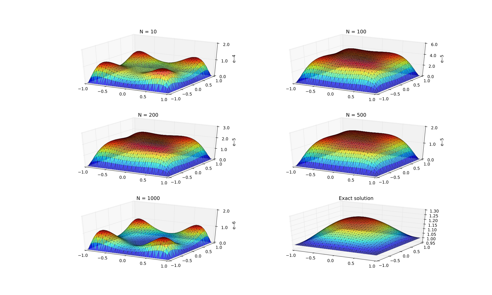
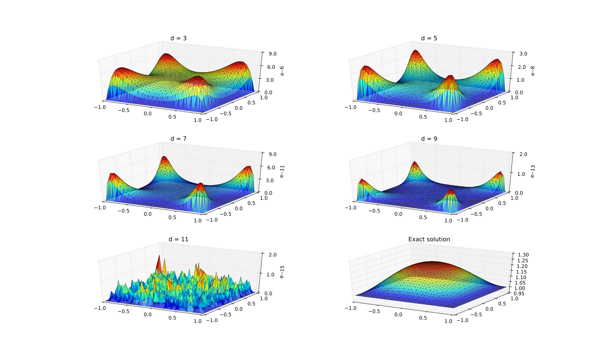

# Cubature Formulas for Multisymmetric Functions

A multisymmetric function is a real-valued function satisfying the following
definition.


For example, the function
`f(x,y,z,w) = x+y+z+w`
is (4,1)-multisymmetric while the function
`g(x,y,z,w) = exp(10*x - y + 10*z - w)`
is (2,2)-multisymmetric.

This repository contains the julia code used in [this paper](https://https://homepage.univie.ac.at/stefan.rigger/Stefan%20Rigger_files/papers/Heitzinger2018Cubature.pdf)
to calculate cubature rules for multisymmetric functions as well as the formulas
obtained using this code. The formulas can be found in
the folder `formulas` and are labelled in the following
way: The file `(n,m,d)-nodes.txt` contains the nodes of a
cubature formula of degree `d` for `(n,m)`-multisymmetric
functions. The corresponding weights can be found in the
file `(n,m,d)-weights.txt`. Note that our approach only yields formulas with odd
degrees.

Should you calculate a formula not yet listed here,
please submit a pull request so we can make it available
to the public. This code is published under a GNU general
public license.

# Requirements
This code is written in julia v0.5. The following packages
are used:
* Combinatorics
* DriftDiffusionPoissonSystems
* FastGaussQuadrature
* Gurobi
* Iterators
* JuMP
* Sobol
* SymPy

Note that the Gurobi Optimization Software is not
Open Source, however free academic licenses are
available.

# How to use the code
To load or calculate cubature formulas with parameters
`(n,m,d)`, execute the following lines in the julia
console

```
julia> include("LPcubature.jl")
julia> nodes,weights = return_cubature_formula(n,m,d)
```
The function `return_cubature_formula(...)` expects three positive integers as
arguments, where the third argument `d` should be odd. The function checks
whether the formula for the parameters `(n,m,d)` is in the folder `formulas`.
If the formula is not found, it is computed and stored there. The function
returns two Arrays with Float64-entries, the nodes and weights of the respective
formula.

# Examples

## Expectation of a stochastic partial differential equation - comparison to quasi-Monte Carlo.

The file `SDEexample.jl` contains the code used to make the plots below.
To compare the efficiency of our formulas to a common integration technique,
we compared our results to results obtained by using a quasi-Monte Carlo method
(the Sobol sequence).



The first plots show the absolute error of the exact expectation to the
approximation obtained by using a quasi-Monte Carlo method with N samples. The
exact expectation is displayed in the last plot.



The first plots above show the absolute error of the exact expectation o
to the approximation obtained by using a multisymmetric cubature rule of degree
d. The exact expectation is displayed in the last plot. The amount of function
evaluations is 4 for d=3 and 48 for d=11. It can be seen that our formulas obtain
much better results needing far less function evaluations compared to
quasi-Monte Carlo.

# Authors
---------
* Gudmund Pammer (gudmund.pammer@tuwien.ac.at)
* Stefan Rigger (stefan.rigger@tuwien.ac.at)
